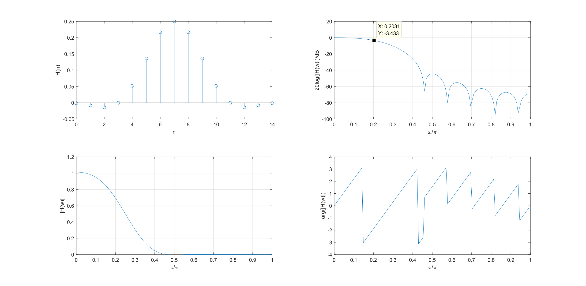

| 实验名称  用窗函数法设计FIR 数字滤波器                                 |                                                                                            |                          |                                                                                                                                |                         |                         |
|------------------------------------------------------------------------|--------------------------------------------------------------------------------------------|--------------------------|--------------------------------------------------------------------------------------------------------------------------------|-------------------------|-------------------------|
| 第一类线性约束$$\theta\left( w \right) = \  - w \cdot \tau$$           | {h\\left( n \\right) = h\\left( N - 1 - n \\right),\\backslash n}{0 \\leq n \\leq N - 1}   | \\tau = \\frac{N - 1}{2} |                                                                                                                                |                         |                         |
| 第二类线性约束$$\theta\left( w \right) = \  - w \cdot \tau \pm \pi/2$$ | {h\\left( n \\right) = - h\\left( N - 1 - n \\right),\\backslash n}{0 \\leq n \\leq N - 1} | \\tau = \\frac{N - 1}{2} |                                                                                                                                |                         |                         |
| **TypeI**                                                              | \\theta\\left( w \\right) = \\  - w \\cdot \\tau                                           | *N为奇数*                | H\\left( w \\right) = \\overset{N - 1}{\\underset{n = 0}{\\Sigma}}a\\left( n \\right)\\cos\\text{nw}                           |                         |                         |
| **TypeII**                                                             |                                                                                            | *N为偶数*                | H\\left( w \\right) = \\overset{N - 1}{\\underset{n = 0}{\\Sigma}}b\\left( n \\right)\\cos{\\left( n - \\frac{1}{2} \\right)w} |                         |                         |
| **TypeIII**                                                            | {\\theta\\left( w \\right) = \\  - w \\cdot \\tau\\backslash n}{\\pm \\pi/2}               | *N为奇数*                | H\\left( w \\right) = \\overset{N - 1}{\\underset{n = 0}{\\Sigma}}c\\left( n \\right)\\sin\\text{nw}                           |                         |                         |
| **TypeIV**                                                             |                                                                                            | *N为偶数*                | H\\left( w \\right) = \\overset{N - 1}{\\underset{n = 0}{\\Sigma}}d\\left( n \\right)\\sin{\\left( n - \\frac{1}{2} \\right)w} |                         |                         |
| **窗函数**                                                             | **窗谱性能分析**                                                                           | **加窗后滤波器性能指标** |                                                                                                                                |                         |                         |
|                                                                        | 旁瓣峰值 （$$dB$$）                                                                        | 主瓣宽度                 | 过滤带宽                                                                                                                       | 阻带最小衰减 （$$dB$$） | 通带边沿衰减 （$$dB$$） |
| 矩形窗                                                                 | \- 13                                                                                      | 4\\pi/N                  | 1..8\\pi/N                                                                                                                     | 21                      | .815                    |
| 三角窗                                                                 | \- 25                                                                                      | 8\\pi/N                  | 6.1\\pi/N                                                                                                                      | 25                      | .503                    |
| 升余弦窗                                                               | \- 31                                                                                      | 8\\pi/N                  | 6.2\\pi/N                                                                                                                      | 44                      | .055                    |
| 汉明窗                                                                 | \- 41                                                                                      | 8\\pi/N                  | 6.6\\pi/N                                                                                                                      | 53                      | .021                    |

1.  实验原理、目的与要求

>   实验全系列可见<https://github.com/pacria/MatlabExp/tree/master/MatlabExp/DSP>

1.  实验目的

>   （1）掌握用窗函数设计$$\text{FIR}$$数字滤波器的原理和方法

>   （2）熟悉线性相位$$\text{FIR}$$数字滤波器特性

>   （3）了解各种窗函数对滤波特性的影响

1.  实验原理

2.  线性相位设计$$\text{FIR}$$滤波器基本特征

>   开门见山地说，$$\text{FIR}$$滤波器与$$\text{IIR}$$滤波器相比有如下特点，值得我们注意

1.  可以实现严格的线性相位，而$$\text{IIR}$$滤波器则是通过相位均衡（群延时均衡）网络来校正它的非线性相位，所得线性相位的结果是近似的。

2.  $$\text{FIR}$$滤波器即有限长$$\text{DF}$$，总是稳定的；且任何非因果的有限长序列经过一定延时也总可以成为因果的。总结地看，设计的$$\text{FIR}$$（可以办到）是因果稳定的。

3.  同样因为$$h\left( n
    \right)$$有限长，所以可以用$$\text{FFT}$$快速算法实现信号过滤，这就给$$\text{FIR}$$的应用带来了很大的实用性。

4.  在相同性能要求的情况下，$$\text{FIR}$$滤波器的阶次要比同时的$$\text{IIR}$$滤波器高，这是其不足之处

5.  $$\text{FIR}$$滤波器的系统函数是$$z^{-
    1}$$的多项式，$$\text{IIR}$$滤波器的系统函数是$$z^{-
    1}$$的有理分式，这是从$$H\left( z \right)$$结构上看出的不同

6.  $$\text{FIR}$$滤波器可以更灵活地设计出正交变换器，线性微分器及其他任意频率特性的滤波器

>   $$\text{FIR}$$滤波器系统函数基本表征为

$$
\begin{matrix}
H\left( z \right) = \overset{N - 1}{\underset{n = 0}{\Sigma}}h\left( n \right)z^{- n}\#\left( 1 \right) \\
\end{matrix}
$$

>   这是$$z^{- 1}$$的$$N - 1$$阶多项式

>   下面我们从线性相位的约束出发，先讨论一下时域上的$$h\left( n
>   \right)$$的特征。

>   取$$\left( 1 \right)$$式中$$z = e^{\text{jω}}$$即得$$h\left( n
>   \right)$$的傅里叶变换，记$$H\left( e^{\text{jw}}
>   \right)$$。将其写成幅值和相角两部分，为

$$
\begin{matrix}
H\left( e^{\text{jw}} \right) = \left| H\left( e^{\text{jw}} \right) \right|e^{\text{jθ}\left( w \right)}\#\left( 2 \right) \\
\end{matrix}
$$

>   按线性相位要求，即

$$
\frac{\text{dθ}\left( w \right)}{\text{dw}} = - \tau,\ \tau
$$

>   可以细分为两类

$$
\begin{matrix}
\theta\left( w \right) = \left\{ \begin{matrix}
 - w \cdot \tau \\
 - w \cdot \tau + \beta \\
\end{matrix} \right|\#\left( 3 \right) \\
\end{matrix}
$$

>   这里的$$\tau,\ \beta$$都是常数

>   将$$\left( 3 \right)$$代入到$$\left( 2
>   \right)$$中，我们先讨论第一类线性相位，有

$$
\begin{matrix}
H\left( e^{\text{jw}} \right) = \overset{N - 1}{\underset{n = 0}{\Sigma}}h\left( n \right)e^{- jnw} = H\left( w \right)e^{\text{jθ}\left( w \right)} = H\left( w \right)e^{- jw\tau}\#\left( 4 \right) \\
\end{matrix}
$$

>   将$$\left( 4 \right)$$按实部，虚部展开，则

$$
\begin{matrix}
\begin{matrix}
\overset{N - 1}{\underset{n = 0}{\Sigma}}h\left( n \right)\cos\text{wn}\& = H\left( w \right)\cos\text{wτ} \\
\overset{N - 1}{\underset{n = 0}{\Sigma}}h\left( n \right)\sin\text{wn}\& = H\left( w \right)\sin\text{wτ} \\
\end{matrix}\#\left( 5 \right) \\
\end{matrix}
$$

>   将$$\left( 5 \right)$$中两式相除消去$$H\left( w \right)$$，可以得到

$$
\begin{matrix}
\overset{N - 1}{\underset{n = 0}{\Sigma}}h\left( n \right)\cos\text{wn} \cdot \sin\text{wτ} = \overset{N - 1}{\underset{n = 0}{\Sigma}}h\left( n \right)\sin\text{wn} \cdot \cos\text{wτ}\#\left( 6 \right) \\
\end{matrix}
$$

>   利用三角公式$$\sin\left( \alpha \pm \beta \right) = sin\alpha\ cos\beta \pm
>   cos\alpha\ sin\beta$$将$$\left( 6 \right)$$式再整理为

$$
\overset{N - 1}{\underset{n = 0}{\Sigma}}h\left( n \right)\sin\left( \tau - n \right)w = 0\#(7)
$$

>   所以说，第一类线性相位约束$$\theta\left( w \right) = \  - w \cdot
>   \tau$$最终等价于$$(7)$$式所表明的，我们关注到：当$$\tau = (N -
>   1)/2$$时，且$$h\left( n \right)$$关于中心点$$(N -
>   1)/2$$偶对称时，对于序列$$\left\{ h\left( n \right)\sin\left( \tau - n
>   \right)w \right\}$$来说总体是对中心点$$(N -
>   1)/2$$奇对称的，满足了$$(7)$$式——亦即符合第一类线性条件。

>   对于第二类线性条件$$\theta\left( w \right) = \  - w \cdot \tau +
>   \beta$$，可以经由类似的过程得到对$$h\left( n
>   \right)$$在时域上的约束结果，这里就不详细展开了，最终可等价地表示为

$$
\begin{matrix}
\overset{N - 1}{\underset{n = 0}{\Sigma}}h\left( n \right)\sin\left\lbrack \left( \tau - n \right)w - \beta \right\rbrack = 0\#\left( 8 \right) \\
\end{matrix}
$$

>   通常的，对于$$\text{FIR}$$滤波器，$$90deg$$移相作用也是常出现地一类应用（譬如希尔伯特变换器）。因此，取$$\beta
>   = \pm \pi/2\$$是常见的，在此补充条件下，$$\left( 8 \right)$$等效地表为

$$
\overset{N - 1}{\underset{n = 0}{\Sigma}}h\left( n \right)\cos\left( \tau - n \right)w = 0\ \ \ \ \ \ \ \ \ \ \ \ \ \ \ \ \ \ \ \ \ \ \ \ \ \ \ \ \ \ \ \ \ \ \ \ \ \ \ \ \ \ \ \ \ \ \ \ \ \ \ \ \ \ \ \ \ \ \ \ \ \ \ \ \ \ \ \ \ \ \ \ (9)
$$

>   这要求$$h\left( n \right)$$关于中心点$$(N - 1)/2$$奇对称且$$\tau = (N -
>   1)/2$$。总结一下，两类线性相位的约束约束条件为

>   即将进一步看到，按照$$N$$的奇偶划分，又可以再细分为四类$$\text{FIR}$$线性相位滤波器。

>   以上是从时域角度，或者说是对$$h\left( n
>   \right)$$的考察，基于此，讨论$$H\left( e^{\text{jw}}
>   \right)$$的不同情形，需要注意的是，由于线性相位已经得到了约束，仅需讨论$$H\left(
>   e^{\text{jw}} \right)$$的幅频函数$$H\left( w \right)$$即可（参考$$\left( 2
>   \right)$$式）

>   分析思路是这样的，由于已经知道$$h\left( n \right) = \pm h\left( N - 1 - n
>   \right)$$，自然想到利用$$z$$变换性质，也就是$$Z\left\{ \pm h\left( N - 1 - n
>   \right) \right\} = \pm z^{- \left( N - 1 \right)}H\left( z^{- 1}
>   \right)$$（利用了移位性质和翻褶性质），有

$$
{H\left( z \right) = \frac{1}{2}Z\left\{ h\left( n \right) \pm h\left( N - 1 - n \right) \right\}\backslash n}{= \frac{1}{2}\left\lbrack H\left( z \right) \pm z^{- \left( N - 1 \right)}H\left( z^{- 1} \right) \right\rbrack\backslash n}{= \frac{1}{2}\overset{N - 1}{\underset{n = 0}{\Sigma}}h\left( n \right)\left\lbrack z^{- n} \pm z^{- \left( N - 1 \right)}z^{n} \right\rbrack\backslash n}\begin{matrix}
 = z^{- \frac{N - 1}{2}\ }\overset{N - 1}{\underset{n = 0}{\Sigma}}h\left( n \right)\frac{z^{\frac{N - 1}{2} - n} \pm z^{- \left( \frac{N - 1}{2} - n \right)}}{2}\#\left( 10 \right) \\
\end{matrix}
$$

>   将$$z$$以$$e^{\text{jw}}$$替换之，先对第一类线性相位做讨论，也就是$$\left(
>   10 \right)$$中$$\pm$$取$$+ \$$的情形，稍作整理，得到下式

$$
H\left( e^{\text{jw}} \right) = e^{- j\frac{N - 1}{2}w} \cdot \overset{N - 1}{\underset{n = 0}{\Sigma}}h\left( n \right)\cos\left\lbrack \left( \frac{N - 1}{2} - n \right)w \right\rbrack\#(11)
$$

>   马上可以观得$$H\left( w \right)$$的结构，我们利用$$\left( 10
>   \right)$$式，再对第二类线性相位做讨论（也就是$$\pm$$取$$-$$），可以得到类似的结论，相关结果记于下表中

$$
{a\left( n \right) = 2h\left( \frac{N - 1}{2} - n \right),\backslash n}{\text{\ a}\left( 0 \right) = h\left( \frac{N - 1}{2} \right),\backslash n}{\ n = 1,\ 2,\ \ldots,\ \frac{N - 1}{2}}
$$

$$
{b\left( n \right) = 2h\left( \frac{N}{2} - n \right),\ \backslash n}{n = 1,\ 2,\ \ldots,\frac{N}{2}}
$$

$$
{c\left( n \right) = 2h\left( \frac{N - 1}{2} - n \right),\ \backslash n}{n = 1,\ 2,\ \ldots,\ \frac{N - 1}{2}}
$$

$$
{d\left( n \right) = 2h\left( \frac{N}{2} - n \right),\backslash n}{\ n = 1,\ 2,\ \ldots,\frac{N}{2}}
$$

>   图表 1

1.  $$\text{FIR}$$窗函数设计法原理

>   窗函数设计法是一种$$\text{FIR}$$时域设计方法，通过对理想的低通/高通/带通/带阻滤波器的$$h\left(
>   n
>   \right)$$进行“加窗”处理使其变成有限长的，同时符合我们前面讨论的线性的线性相位条件。

>   毫无疑问，加窗过程是这里的核心问题，我们设理想的数字滤波器冲激响应为$$h_{d}\left(
>   n \right)$$（马上会看到，这是一个无限长的），并有窗函数$$w\left( n
>   \right)$$，所谓的“加窗”就是

$$
\begin{matrix}
h\left( n \right) = h_{d}\left( n \right) \cdot w\left( n \right)\#\left( 12 \right) \\
\end{matrix}
$$

>   表现在频域上，由卷积定理，有

$$
\begin{matrix}
H\left( e^{\text{jw}} \right) = \frac{1}{2\pi}H_{d}\left( e^{\text{jw}} \right)*W\left( e^{\text{jw}} \right)\#\left( 13 \right) \\
\end{matrix}
$$

>   无疑，实际的$$H\left( e^{\text{jw}} \right)$$与理想情形——$$H_{d}\left(
>   e^{\text{jw}} \right)$$是有一定差别的，这与$$W\left( e^{\text{jw}}
>   \right)$$的选取有关，在这里，我们先考虑低通/高通/带通/带阻的各理想情况。

>   对于理想线性相位低通滤波器，应有

$$
H_{d}\left( e^{\text{jw}} \right) = \{\begin{matrix}
\& e^{- jw\tau},\ \& 0 \leq \left| w \right| \leq w_{c} \\
\& 0,\ \& w_{c} < \left| w \right| \leq \pi \\
\end{matrix}\ 
$$

>   $$w_{c}$$是理想的截止频率，是通频带和阻带的交界。由离散傅里叶变换逆变换得

$$
{h_{d}\left( n \right) = \frac{1}{2\pi}\int_{- \pi}^{\pi}{H_{d}\left( e^{\text{jw}} \right)e^{\text{jwn}}\text{dw}}\backslash n}{= \frac{1}{2\pi}\int_{- w_{c}}^{w_{c}}{e^{- jw\tau}e^{\text{jwn}}\text{dw}}\backslash n}\begin{matrix}
 = \begin{matrix}
\&\frac{\sin\left\lbrack w_{c}\left( n - \tau \right) \right\rbrack}{\pi\left( n - \tau \right)},\ \&\ n \neq \tau \\
\&\frac{w_{c}}{\pi},\ \& n = \tau\left( \tau \right) \\
\end{matrix}\#\left( 14 \right) \\
\end{matrix}
$$

>   经过前面的讨论，可以知道$$\tau = \left( N - 1 \right)/2\$$

>   对于带通滤波器，这可以理解为一个截止频率为$$w_{2}$$的低通滤波器减去一个截止频率为$$w_{1}$$的的低通滤波器；对于高通滤波器，可以认为是一个全通滤波器减去一个低通滤波器来实现；对于带阻滤波器，这可以认为是一个全通滤波器减去一个带通滤波器来实现。

>   例如截止频率为$$w_{c}$$的高通滤波器，它的单位抽样响应就为

$$
\begin{matrix}
h_{d}\left( n \right) = \begin{matrix}
\& - \frac{\sin\left\lbrack w_{c}\left( n - \tau \right) \right\rbrack}{\pi\left( n - \tau \right)},\ \&\ n \neq \tau \\
\& 1 - \frac{w_{c}}{\pi},\ \& n = \tau\left( \tau \right) \\
\end{matrix}\#\left( 15 \right) \\
\end{matrix}
$$

1.  窗函数的选择

>   在加窗处理后，原$$h_{d}\left( n \right)$$无线长被处理为$$N$$点长$$h\left( n
>   \right)$$，由于我们使用的窗函数也是线性相位的，所以加窗后仍是线性相位的。

>   在实际设计中，需要的技术参数有阻带最小衰减$$A_{s}$$和过渡带宽$$\text{Δω}$$，这是由窗函数的类型和其点数$$N$$共同决定的，这一领域已经总结了基本的内容，如下表所示

>   图表 2

>   有了表格中的总结，$$\text{FIR}$$滤波器窗函数设计变得有迹可循，首先是根据要求中阻带的最小衰减确定窗函数形状，再有过渡带宽确定窗长，也就是其点数$$N$$，为了频谱分析的方便，我们常将加窗后的序列补零到$$2\$$的整数幂长度。

>   二、实验仪器设备**（**标注实验设备名称及设备号**）**

>   **装有Matlab R2018a的计算机一台**

>   三、实验线路示图、内容步骤

1.  设计理想低通滤波器$$h_{d}\left( n \right)$$

>   从总体框架上看，程序的设计可以包括对三部分序列的产生与分析，也即是$$h_{d}\left(
>   n \right),\ w\left( n \right),\ h\left( n
>   \right)$$。我们首先产生理想低通滤波器的冲激序列$$h_{d}\left( n \right)$$


>   这部分的实现是基于式$$\left( 14
>   \right)$$的工作，需要注意，由于我们只能处理$$\text{FIR}$$序列，而$$\left( 14
>   \right)$$给出的序列自身是无限长的，所以隐含一个截断的过程——也就相当于加了一个平凡的矩形窗；还要注意，由于在$$\tau
>   = (N - 1)/2\$$处$$\sin\left\lbrack w_{c}\left( n - \tau \right)
>   \right\rbrack/\pi\left( n - \tau
>   \right)$$是“分子分母同时为零”，所以我们在这里专门给出其值为$$w_{c}/\pi$$。在实际处理中，可以不必一定分段处理，而要使$$n
>   - \tau$$加上一个小量eps(1e-10)这样我们就可以利用$$\sin\left\lbrack
>   w_{c}\left( n - \tau \right) \right\rbrack/\pi\left( n - \tau
>   \right)$$一致求解$$h_{d}\left( n
>   \right)$$了。下面就是本次用于产生理想低通的函数代码，N是截断点数

>   function [hd, tau] = ideallp(wc, N)

>   % Ideal low-pass digital filter(with cut-off angular frenquency wc)

>   tau = (N-1)/2;

>   n = 0:N-1;

>   m = n - tau + eps; % Avoid ZeroDivision Error

>   hd = sin(wc \* m)./(pi \* m);

>   end

>   由于这里涉及到的$$\text{FIR}$$滤波器总是线性相位的，我们可以利用图表
>   1中的结论，对四种类型的$$\text{FIR}$$滤波器求其幅值函数$$H\left( \omega
>   \right)$$（当然也可以利用在实验二中编写的fft_anylsis进行分析），通过编写函数amplres完成对任一种$$\text{FIR}$$滤波器的分析

>   具体的编写参考了书本P541的内容，有较大的参考意义——因其写法简练，通过模余式mod(N,
>   2)隐式地完成了分支处理，调用格式为

>   function [Hw, w, type] = amplres(h, M)

>   其中h, M分别对应于$$\text{FIR}$$滤波器的冲激响应和频域分析点数，Hw,
>   w,分别是其幅频函数以及对应的频域向量（是一个M点向量），type表明了$$\text{FIR}$$滤波器的类型，与图表
>   1中的记法完全一致。

>   这个函数的具体实现过程见附录

>   再强调一下，由于本实验均是对$$\text{FIR}$$序列（$$h_{d}\left( n \right),\
>   w\left( n \right),\ h\left( n
>   \right)$$）做处理，所以函数amplres在其频域分析有相当的通用性。从计算量角度来说，它的计算量也并不大（主要是进行余弦或正弦的运算，这在$$\text{FFT}$$快速算法同样出现）

1.  设计窗函数$$w\left( n \right)$$


>   这里我们利用Matlab内置的函数

```matlab
w = hanning(N);

w = hamming(N);

w = rectwin(N);

w = triang(N);
```

>   求解窗函数的时域$$\text{FIR}$$序列，上述各窗函数均接受窗长N，并返回w（这是一个列向量），即为对应的窗函数$$w\left(
>   n \right)$$

>   在实验的第二部分，要求用四种窗函数分别设计并分析，所以设计一个简单的分支程序完成处理

>   function w = choose_win_type(win_type, N)

>   win_type是自定参数，决定窗函数的类型。

>   随后同样设计绘图程序打印序列w以及其幅度频谱（可由amplres生成）

1.  加窗产生$$h\left( n \right)$$并作频域分析


>   如$$\left( 12 \right)$$式所表明的，我们加窗得到希望的$$\text{FIR}$$序列

>   h = wn.\*hd; % Get your window

>   （在前面wn已经转置为一个行向量

>   wn = choose_win_type(win_type, N)';

>   ）

>   这里需要得到其$$d\text{B\
>   }$$表征的对数幅频曲线，可以利用之前实验使用到的自定函数

>   function [db, mag, pha, grd, w] = freqz_m(b, a, M)

>   其中的关键步骤是

>   [H, w] = freqz(b, a, M\*2, 'whole');

>   H = H(1:M)'; w = w(1:M)';

>   mag = abs(H);

>   db = 20\*log10((mag+eps)/max(mag));

>   还要注意，函数 freqz_m接受的是一组多项式向量b,
>   a以及频域抽样点数M。我们在开头提到过，$$\text{FIR}$$滤波器的系统函数是$$z^{-
>   1}$$的多项式——也就是说，它的分母多项式为[1], 分子多项式就为h自身

>   所以这里的调用过程为

>   [db, mag, pha, grd, w] = freqz_m(h, [1], M);

>   此外，由于频域抽样响应函数freqz有关$$\text{DFT}$$的内容，所以隐含涉及到$$\text{FFT}$$快速算法，不再需要额外实现。

>   四、实验数据记录及数据处理

>   并参考附录代码中的experiment recipe 部分

1.  EXP1

>   实验的第一部分的主要内容是，用升余弦窗（即hanning窗）设计一个N点长低通$$\text{FIR}$$滤波器，分别取N=15和N=33(由于N是奇数，结合hd序列关于tau偶对称的特点，得知这总是**TypeI**),

>   当N=15时候，$$h_{d}\left( n \right),\ w\left( n \right),\ h\left( n
>   \right)$$分别为


>   从图中也可看出，由于hd被截断到N点长，相当于加了平凡的矩形窗，得到的幅频曲线有了明显的过渡带，且有波纹波动。而在设计的$$w_{c}(\pi/4)$$处是其三分贝点。


>   上图中$$H_{d}(\omega)$$与$$Cut - off\ frenquency$$标注应交换一下

>   设计出的窗函数幅频曲线为


>   特别观察$$3\text{dB\ }$$和$$20dB$$点




>   当N=33时，再做设计，有


>   相较于N=15时的情形，可直观地感受到阻带衰减变快了，同时$$w_{c}$$的三分贝点特征并未改变(注意这是未加汉宁窗的情形)


>   加窗后为：


>   上图中$$H_{d}(\omega)$$与$$Cut - off\ frenquency$$标注应交换一下

>   同样从幅频角度分析，作图为


>   再次观察$$3\text{dB\ }$$和$$20dB$$点

>   再次观察$$3\text{dB\ }$$和$$20dB$$点


>   明显注意到，$$3dB\ \sim
>   20dB$$这一段的带宽，相较于点数更少的N=15的情形，已经收窄了。

>   从中我们可以定性地说，窗长N越大，过渡带宽就越窄，另外从阻带衰减的角度看，两次加升余弦窗，阻带衰减都略大于40dB，没有明显差别。这也说明了阻带衰减要依靠窗函数的类型决定，且与图表
>   2给出的技术指标是一致的。

1.  EXP2

>   实验的第二部分，要求我们取定N=33，$$w_{c} =
>   \pi/4$$不变，考察不同窗类型的影响。

>   先来看最简单的矩形窗，如前所述，我们对hd的自然N点截断事实上就是加过矩形窗的了，单独给出矩形窗的特性


>   其幅频特性为


>   观察得到矩形窗的阻带衰减只有20dB左右（21dB），过渡带带宽约在.04$$\pi$$左右（0.0545$$\pi$$）

>   下面来看使用三角窗的结果

>   三角窗自身为


>   加窗后


>   幅频特征为


>   可以观看到其阻带衰减也不大（25dB），过渡带带宽大致为.18$$\pi$$（0.01848$$\pi$$）

>   最后来看使用汉明窗的结果

>   其自身为


>   加窗后


>   幅频特征为


>   可以观察汉明窗的阻带也介于40dB与60dB之间，比升余弦窗的要大一点（53dB），过渡带宽约为.16$$\pi$$(.20$$\pi$$)

>   五、实验结论探讨及分析

>   通过本实验，我们掌握了$$\text{FIR}$$数字滤波器窗函数设计法基本设计方法，首先我们由理想低通/高通/带通/带阻数字滤波器原型求出截断为N点长的$$h_{d}\left(
>   n \right)$$，随后按照选定窗函数类型，有$$w\left( n
>   \right)$$加窗得到$$h_{d}\left( n \right)w\left( n
>   \right)$$。在频域上，根据$$\left( 13
>   \right)$$式阐明的基本原理，可以知道加窗后的频谱将与原理想情形不同，并有过渡带宽，阻带最小衰减等技术参数。

>   窗函数法是一种基本的$$\text{FIR}$$数字滤波器时域设计办法，效果与窗长和窗口类型有关。通常地说，当窗口类型越缓变，其旁瓣峰值越小，带来的阻带衰减就越大，于此同时主瓣宽度也会随之增大，导致过渡带宽的增加。为了进一步减小过渡带宽（到我们希望的范围），基于同一种窗口类型，窗长N越大，带来的过渡带宽越小。在实验中，同样印证了这一点，先后取N=15,
>   33并有四种不同窗类型选择，给我们对其设计带来了总体上的认识。

>   总的来看，窗函数设计法是一种模式固定的$$\text{FIR}$$设计办法，通过“求解参数-\>设计窗函数-\>加窗-\>验证”一系列流程，得到需要的滤波器类型。（基于技术参数的确定参考思考题1）

>   思考题：

1.  如果给定通带截止频率$$w_{p}$$和阻带衰减频率$$w_{\text{st}}$$，以及阻带最小衰减$$A_{s}$$，如何用窗函数法进行设计？

>   通过实验我们可以知道，在设计过程中，我们只需要窗长$$N$$和窗口类型就足以完成。实验中N和omegaC均已事先给出，在本问中则并没有出现，所以我们需要根据技术参数$$w_{p},\
>   w_{\text{st}},\ A_{s}$$共同决定

>   在实验原理部分窗函数的选择中我们已经介绍了基本方法，这里通过流程图再引述一遍


>   其中，图表
>   2已经列出了常见的几种窗函数及其技术指标类型，确定窗长$$N$$和窗口类型之后进而可按本实验步骤进行下去。

1.  如果要求窗函数设计法设计带通滤波器，给定上下边截止频率为$$w_{1},w_{2}$$，求其理想带通的单位脉冲响应

>   在本报告P4页简单说明了如何将带通/带阻/高通滤波器理解为低通滤波器与全通滤波器的组合，按照说明“带通滤波器，这可以理解为一个截止频率为$$w_{2}$$的低通滤波器减去一个截止频率为$$w_{1}$$的的低通滤波器”（保证$$w_{2}
>
>   > w_{1}$$），我们容易得到其理想冲激响应为

$$
h_{d}\left( n \right) = \begin{matrix}
\&\frac{\sin\left\lbrack w_{2}\left( n - \tau \right) \right\rbrack}{\pi\left( n - \tau \right)} - \frac{\sin\left\lbrack w_{1}\left( n - \tau \right) \right\rbrack}{\pi\left( n - \tau \right)},\ \& n \neq \tau \\
\&\frac{w_{2}}{\pi} - \frac{w_{1}}{\pi},\ \&\ n = \tau\left( \tau \right) \\
\end{matrix}
$$

>   我们同样绘制一下时域上的表现（按N=33截断）


>   参考代码为（不在附录中列出）

>   x_bp = ideallp(pi/3, N2) - ideallp(pi/4, N2);

>   figure

>   stem(0:N2-1, x_bp);

>   grid on

>   xlabel('n')

>   ylabel('h_d(n)')

>   title('\\omega_2=\\pi/3, \\omega_1=\\pi/4')

>   六、附录

代码地址见<https://github.com/pacria/MatlabExp/blob/master/MatlabExp/DSP/exp4/Demo.m>

图片地址见<https://github.com/pacria/MatlabExp/tree/master/MatlabExp/DSP/exp4/checkedSVG>

>   % EXPERIMENT RECIPE HERE

>   % EXP1

>   % Choose N = N1, N2; win_type = hanning

>   % EXP2

>   % Choose N = N2;

>   %win_type = rect; win_type = triang; win_type = hamming

>   **预设变量区**

>   % Pre-defined

>   N1 = 15;

>   N2 = 33;

>   N = N2;

>   omegaC = pi/4;

>   hanning = 'hn';

>   hamming = 'hm';

>   rect = 'r'; % Do nothing(Because it's already fixed to N point)

>   triang = 'tr'

>   win_type = hamming; % Choose one type (DEFAULT: hanning)

>   bianer = 3;

>   M = 2\^ceil(log2(N)+bianer);

>   n = 0:N-1;

>   **函数定义区**

>   function [hd, tau] = ideallp(wc, N)

>   % Ideal low-pass digital filter(with cut-off angular frenquency wc)

>   tau = (N-1)/2;

>   n = 0:N-1;

>   m = n - tau + eps; % Avoid ZeroDivision Error

>   hd = sin(wc \* m)./(pi \* m);

>   end

>   function [Hw, w, type] = amplres(h, M)

>   N = length(h);

>   L = floor((N-1)/2);

>   h = h(:)';

>   n = 1:L+1;

>   w = (0:M)\* 2 \*pi /(M+1);

>   if all(abs(h(n) - h(N - n + 1))\<1e-10)

>   % Class I(Type I or Type II)

>   Hw = 2 \* h(n) \* cos(((N+1)/2 - n)' \* w) - mod(N, 2) \* h(L+1);

>   type = 2 - mod(N, 2); %N - Even, type-\>2, N - Odd, type -\> 1.

>   elseif all(abs(h(n) - h(N - n + 1))\<1e-10)&&(h(L+1) \* mod(N, 2) == 0)

>   Hw = 2 \* h(n) \* sin(((N+1)/2 - n)' \* w);

>   type = 4 - mod(N, 2); %N - Even, type-\>4, N - Odd, type -\> 3.

>   else error('Not a linear phase FIR filter');

>   end

>   end

>   function w = choose_win_type(win_type, N)

>   switch win_type

>   case 'hn'

>   w = hanning(N);

>   case 'hm'

>   w = hamming(N);

>   case 'r'

>   w = rectwin(N);

>   case 'tr'

>   w = triang(N);

>   end

>   end

>   function [db, mag, pha, grd, w] = freqz_m(b, a, M)

>   [H, w] = freqz(b, a, M\*2, 'whole');

>   H = H(1:M)'; w = w(1:M)';

>   mag = abs(H);

>   db = 20\*log10((mag+eps)/max(mag));

>   pha = angle(H);

>   grd = grpdelay(b, a, w);

>   end

>   **IDEAL LOWPASS**

>   [hd, tau] = ideallp(omegaC, N);

>   [hdw, w, \~] = amplres(hd, M);

>   figure

>   subplot(2, 1, 1)

>   stem(n, hd)

>   xlabel('n')

>   ylabel('h(n)')

>   subplot(2, 1, 2)

>   plot(w/pi, hdw)

>   grid on

>   hold on

>   plot([omegaC/pi omegaC/pi], ylim)

>   hold off

>   xlabel('\\omega/\\pi')

>   legend('\|H_d(\\omega)\|(Rect)', 'Cut-off frenquency')

>   **GET WINDOW**

>   % Get window

>   wn = choose_win_type(win_type, N)';

>   [Hww, w, \~] = amplres(wn, M);

>   figure

>   subplot(2, 1, 1)

>   stem(n, wn)

>   xlabel('n')

>   ylabel('w(n)')

>   subplot(2, 1, 2)

>   plot(w/pi, Hww)

>   grid on

>   xlabel('\\omega/\\pi')

>   ylabel('\|W(\\omega)\|')

>   **FIR & ANLYSIS**

>   % Get -h

>   h = wn.\*hd; % Get your window

>   [hw, w, \~] = amplres(h, M);

>   figure

>   subplot(2, 1, 1)

>   stem(n, hd)

>   hold on

>   stem(n, h)

>   hold off

>   xlabel('n')

>   legend('H_d(n)', 'H(n)')

>   subplot(2, 1, 2)

>   plot(w/pi, hw)

>   grid on

>   hold on

>   plot([omegaC/pi omegaC/pi], ylim)

>   plot(w/pi, hdw)

>   hold off

>   xlabel('\\omega/\\pi')

>   legend('\|H(\\omega)\|', '\|H_d(\\omega)\|(Rect)', 'Cut-off frenquency')

>   [db, mag, pha, grd, w] = freqz_m(h, [1], M);

>   figure

>   subplot(2, 2, 1)

>   stem(n, h)

>   xlabel('n')

>   ylabel('H(n)')

>   subplot(2, 2, 2)

>   plot(w/pi, db)

>   grid on

>   xlabel('\\omega/\\pi');

>   ylabel('20log(\|H(w)\|)/dB')

>   subplot(2, 2, 3)

>   plot(w/pi, mag)

>   grid on

>   xlabel('\\omega/\\pi')

>   ylabel('\|H(w)\|')

>   subplot(2, 2, 4)

>   plot(w/pi, pha)

>   xlabel('\\omega/\\pi')

>   ylabel('arg(\|H(w)\|)')
